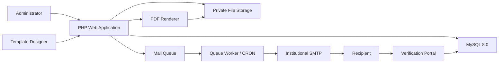

# Architecture

## System Context

The platform has four operational areas:

1. Administrative web application for templates, recipients, SMTP profiles, and delivery schedules.
2. Certificate rendering service that converts approved layouts and recipient data into PDF/A.
3. Distribution queue that sends certificates through institutional SMTP at controlled speed.
4. Verification and reporting layer that validates issued credentials and monitors delivery.
5. Audit and security layer that records administrative activity, authentication events, and delivery outcomes.

## Runtime Components

| Component | Responsibility |
| --- | --- |
| Web application | Authentication, MFA, template management, CSV import, scheduling, reporting |
| Template designer | Visual placement of text elements over uploaded image backgrounds |
| PDF renderer | Converts layout JSON and recipient rows into PDF/A certificates |
| SMTP module | Stores encrypted SMTP profiles and sends attachments through TLS/SSL |
| Queue worker | Sends one message at configured intervals and records retry outcomes |
| Verification portal | Confirms issued certificates using certificate number and token |
| Audit logger | Captures administrative actions and system events |

## Data Flow

1. Administrator creates or uploads a certificate background.
2. Designer positions bilingual text elements on a visual canvas.
3. Template is approved before production use.
4. Operator uploads CSV data and maps headers to template fields.
5. System validates the CSV and creates recipient rows.
6. Renderer generates one PDF/A file per recipient.
7. Operator selects email template, SMTP profile, schedule, and throttling speed.
8. System checks email template variables against recipient data before queue release.
9. Queue worker sends messages at the configured interval.
10. Recipients can verify certificate metadata through the verification portal.
11. Audit log records the full chain.

## Design Decisions

- Use MySQL `utf8mb4` everywhere to support Arabic and English safely.
- Treat generated PDFs as private files, never public static assets.
- Store SMTP passwords encrypted using sodium secretbox.
- Keep the queue in MySQL for operational simplicity in small and mid-sized institutions.
- Claim queue rows inside a database transaction with row-level locking to avoid duplicate sends when multiple workers run.
- Recover stale `processing` rows with a configurable timeout so worker crashes do not permanently block scheduled delivery.
- Use CRON or a process supervisor for scheduled delivery.
- Make template layout data explicit JSON so it can be versioned and reviewed.
- Store only hashed verification tokens so public validation links do not expose reusable secrets in the database.
- Treat revocation as a certificate lifecycle state so withdrawn credentials stop validating without deleting issuance evidence.

## Future Extensions

- SAML/OIDC single sign-on.
- Signed PDF support.
- Object storage backend.
- Role-based approval workflows.
- Webhook notifications for sent, bounced, or failed events.
