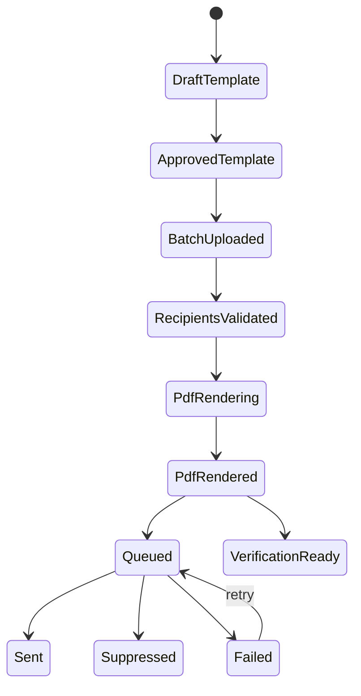

# Database Design

The database is designed around explicit approval, traceable batch processing, and bilingual recipient data.

## Encoding

All tables use:

```sql
DEFAULT CHARSET=utf8mb4 COLLATE=utf8mb4_unicode_520_ci
```

This supports Arabic, English, symbols, and mixed-direction text. Application responses should also use UTF-8 headers.

## Key Tables

| Table | Purpose |
| --- | --- |
| `users` | Administrative accounts, roles, MFA state, password age |
| `mfa_secrets` | Encrypted TOTP secrets |
| `smtp_profiles` | Institutional SMTP settings with encrypted passwords |
| `certificate_templates` | Approved and draft template layouts |
| `certificate_template_versions` | Version history for layout changes |
| `recipient_batches` | CSV upload batches linked to a template |
| `recipients` | Recipient rows with normalized fields and full JSON payload |
| `certificate_jobs` | Rendering state, revocation state, PDF path, hash, and verification token per recipient |
| `certificate_verification_events` | Public verification attempts and lookup audit data |
| Private hash manifest files | Batch-level evidence files that preserve certificate numbers, recipient identifiers, PDF SHA-256 hashes, and a manifest SHA-256 hash |
| `email_templates` | Bilingual email bodies and dynamic tags |
| `mail_queue` | Scheduled, throttled, retryable email delivery |
| `email_suppressions` | Hashed recipient suppression records for hard bounces, complaints, manual holds, and policy blocks |
| `delivery_events` | Queue lifecycle, retry, sent, failed, and bounce events |
| `audit_log` | Administrative and system activity |

## Certificate Lifecycle



## Data Retention

Recommended defaults:

| Data | Retention |
| --- | --- |
| CSV upload source | Delete after validation unless policy requires retention |
| Recipient rows | Retain according to certificate verification and privacy policy |
| Generated PDFs | Retain for the certificate validity period or institutional policy |
| Verification events | Retain for audit and abuse monitoring |
| Delivery events | Retain for operational reporting and SMTP troubleshooting |
| Suppression records | Retain while active and review periodically for scoped/manual releases |
| Audit logs | Minimum 1 year; longer for regulated environments |
| SMTP test logs | 30 to 90 days |

## Privacy Notes

Recipient data can include names, email addresses, program names, and identifiers. Treat it as personal data. Access should be role-limited and logged.
